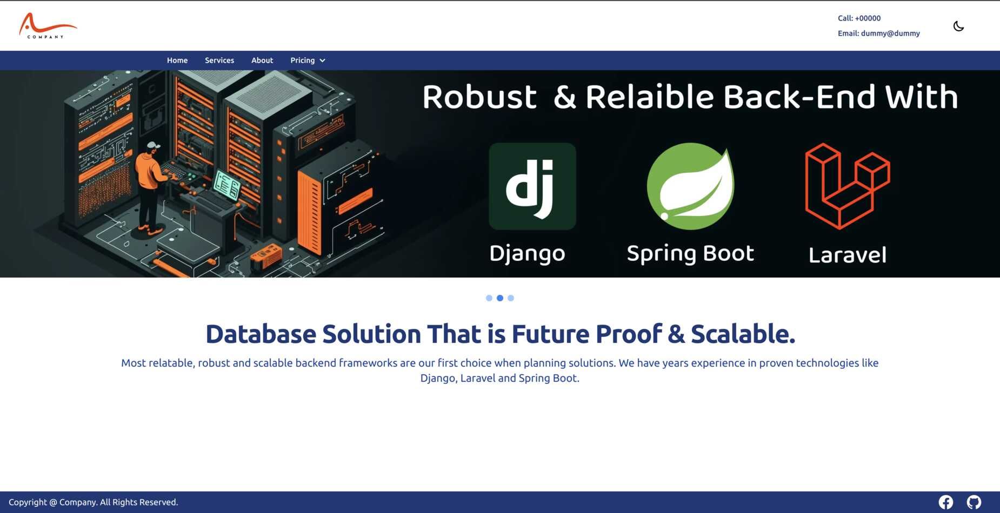

# Website Overview
<h3> Visit the website by clicking the image below.  </h3>

 
 

 

# Features
<ul>
    <li>Responsive </li>
    <li>Dark Mode Support</li>
    <li>Modular </li>
    <li>Follow convention to add content to website. For example adding new "Pricing Item" inside "Pricing" will only require a dictionary containing information in key pair value pair will do the trick. For better understating view "App.vue" source file </li>

</ul>

# Framework/Library 
<ul>
    <li> Vue 3 </li>
    <li> GSAP </li>
    <li> Tailwind & Flowbite </li>
</ul>

# Setup
<ol>
    <li> Clone or Download this Repository. </li>
    <li> Navigate to the directory. </li>
    <li> Install Node.js (LTS Version: 18.17.0). </li>
    <li> Using "npm install" command install dependencies.</li>
    <li> After that use "npm run dev" to start a development server at local host. </li>
</ol>

# Attribution
Some media items (such as Logo, Stock Image, Vector) used for the website are collected from,
<ul>
<li><a href="https://www.freepik.com/">Freepik</a>  </li>

<li><a href="https://www.svgrepo.com/">Svgrepo</a>  </li>

<li><a href="https://midjourney.com/">Mid Journey (AI)</a>  </li>

</ul>
